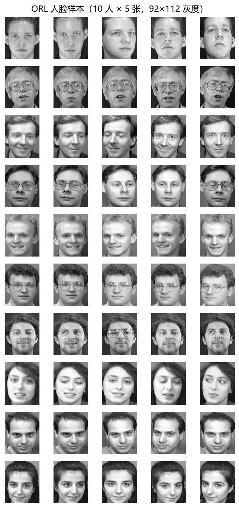
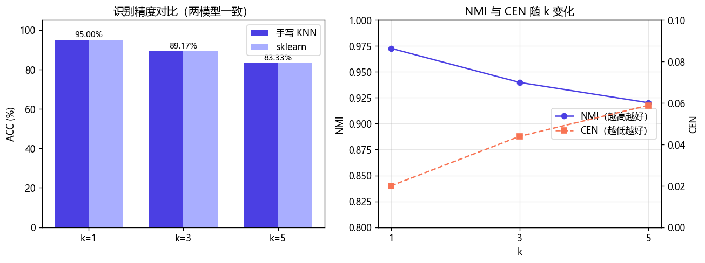
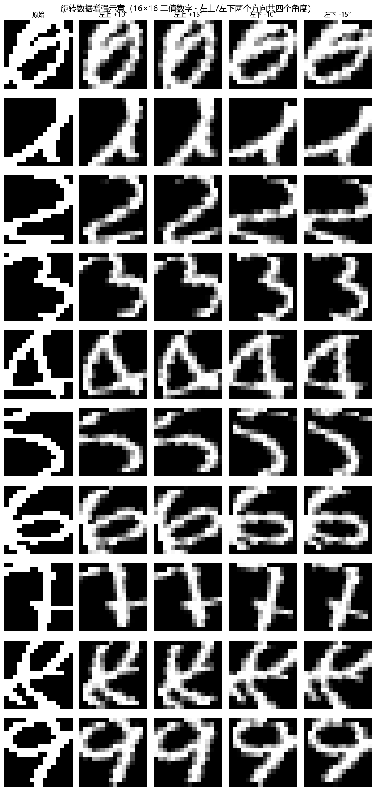
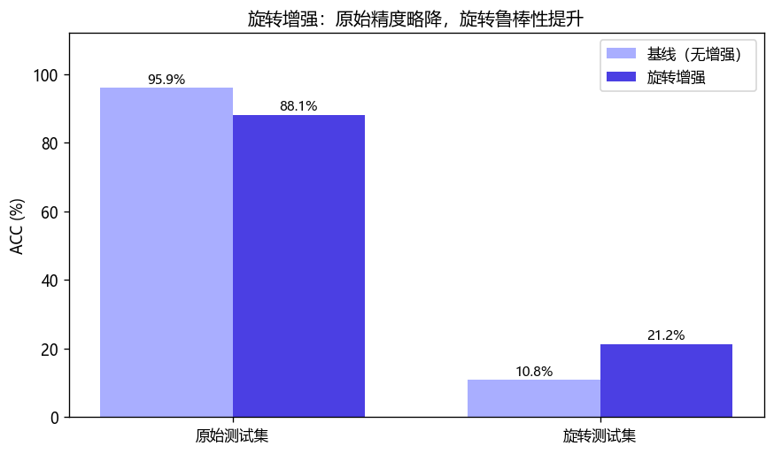

# 实验一：基于 kNN 的手写数字识别（实验报告）

学院：计算机科学与网络空间安全学院     姓名：李梦涛     学号：2412483 

## 一、实验概述

**题目**：基于 kNN 的手写数字识别

**实验条件**：给定 Semeion 手写数字数据集（16×16 二值像素，共 1593 个样本、10 类数字 0~9），给定 kNN 分类算法。

**实验要求**：

| 级别  | 要求                                                           |
| --- | ------------------------------------------------------------ |
| 初级  | 编程实现 kNN 算法；给出 k=5、9、13 时用留一法（LOO）评估的识别精度                    |
| 中级  | 下载人脸图像数据，用 kNN 做人脸识别，与机器学习包（sklearn）的 kNN 对比，指标含 ACC、NMI、CEN |
| 高级  | 用旋转等手段扩充数据库（左上、左下两个方向），采用 CNN 实现手写体识别                        |

**开发环境**：Python 3.14.0、PyTorch 2.10.0（CPU）、scikit-learn 1.9.1、NumPy、SciPy、Matplotlib。

**代码仓库**：[KaGaMi9999/nku-2026-machinelearning](https://github.com/KaGaMi9999/nku-2026-machinelearning)

---

## 二、初级要求：kNN 算法实现与留一法评估

### 2.1 实验内容

手写实现 kNN 分类器，采用留一法在 k = 5、9、13 下评估手写数字识别精度。

### 2.2 实现方法

- **数据**：`data/semeion.data`，每行 256 个二值像素特征 + 10 类 one-hot 标签，共 1593 个样本。
- **距离度量**：欧氏距离。代码中用平方欧氏距离的矩阵展开
  `‖a−b‖² = ‖a‖² + ‖b‖² − 2·a·b` 一次算出全部距离，避免逐点循环。
- **投票**：取距离最近的 k 个样本做多数投票，平票时取类别编号最小者（保证结果确定性）。
- **评估**：留一法——每个样本轮流作为测试集，其余 1592 个作训练集，共 1593 次预测。

代码文件：`codes/knn_semeion.py`

### 2.3 实验结果

| k 值 | 正确数  | 错误数 | 识别精度 ACC   |
| --- | ----:| ---:| ----------:|
| 5   | 1441 | 152 | 90.46%     |
| 9   | 1453 | 140 | **91.21%** |
| 13  | 1442 | 151 | 90.52%     |

### 2.4 分析

留一法下 k=9 精度最高（91.21%）。k 过小易受噪声样本干扰，k 过大则被多数类稀释，k 是需要调优的敏感超参数。

---

## 三、中级要求：人脸识别 + 与 sklearn 对比

### 3.1 实验内容

下载人脸识别图像数据，用 kNN 做人脸识别，并与机器学习包（sklearn）中的 kNN 分类器对比，性能指标为 ACC、NMI、CEN。

### 3.2 实现方法

- **数据**：从剑桥大学 AT&T 的 ORL 人脸库下载 `att_faces.zip`（约 3.6 MB），解压得 **40 人 × 10 张 = 400 张**人脸灰度图（PGM 格式，92×112，即 10304 维特征）。存放于 `data/orl/`。
- **划分**：分层随机划分，70% 训练（280 张）/ 30% 测试（120 张），`random_state=42`，两模型使用完全相同的训练/测试集。
- **对比对象**：手写 KNN vs `sklearn.neighbors.KNeighborsClassifier`（均用欧氏距离 + 等权投票）。
- **指标**：
  - **ACC**：`accuracy_score`；
  - **NMI**：`normalized_mutual_info_score`；
  - **CEN**：按 Wei et al. (2010) 定义实现，范围 [0,1]，越小越好。基于混淆矩阵 C，
    `CEN = Σ_j P_j · CEN_j`，其中 `P_j = (第j行和+第j列和)/(2S)`。

代码文件：`codes/knn_face.py`

### 3.3 实验结果

| k   | 模型      | ACC        | NMI    | CEN    |
| --- | ------- | ---------- | ------ | ------ |
| 1   | 手写 KNN  | **95.00%** | 0.9727 | 0.0200 |
| 1   | sklearn | **95.00%** | 0.9727 | 0.0200 |
| 3   | 手写 KNN  | 89.17%     | 0.9398 | 0.0439 |
| 3   | sklearn | 89.17%     | 0.9398 | 0.0439 |
| 5   | 手写 KNN  | 83.33%     | 0.9202 | 0.0588 |
| 5   | sklearn | 83.33%     | 0.9202 | 0.0588 |





### 3.4 分析

手写 KNN 与 sklearn 在 ACC、NMI、CEN 三项指标上**完全一致**，验证了手写实现的正确性。k=1 精度最高（95.00%），因 ORL 每类仅 7 张训练样本，最近邻即可，k 增大反而被近似样本稀释。

---

## 四、高级要求：旋转数据增强 + CNN 手写体识别

### 4.1 实验内容

采用旋转手段扩充数据库（左上、左下两个方向），用 CNN 实现手写体识别。

### 4.2 实现方法

- **数据**：Semeion 手写数字（16×16 二值），分层划分训练 1274 / 测试 319。

- **旋转扩充**：对训练集做 **左上（逆时针，正角）+10°、+15°** 与 **左下（顺时针，负角）−10°、−15°** 共四个方向旋转（`scipy.ndimage.rotate`，双线性插值），训练集扩充为 5 倍（1274 → 6370）。

- **模型**：PyTorch CNN，结构如下：
  
  ```
  输入 16×16×1
    ├─ Conv2d(1→32, 3×3) + ReLU + MaxPool(2)  → 8×8×32
    ├─ Conv2d(32→64, 3×3) + ReLU + MaxPool(2) → 4×4×64
    ├─ Flatten → 1024
    ├─ Linear(1024→128) + ReLU + Dropout(0.3)
    └─ Linear(128→10) → softmax
  ```

- **训练**：Adam（lr=1e-3）、CrossEntropyLoss、batch=64、40 epoch。

代码文件：`codes/cnn_handwritten.py`

### 4.3 实验结果

| 模型      | 原始测试集 ACC  | 旋转测试集 ACC  |
| ------- | ----------:| ----------:|
| 基线（无增强） | **95.92%** | 10.82%     |
| 旋转增强    | 88.09%     | **21.24%** |





### 4.4 分析

旋转增强使**旋转鲁棒性提升约 +10.4 个百分点**（旋转测试集 10.82% → 21.24%），证明模型学到了旋转不变性。原始精度略有下降（95.92% → 88.09%），原因是 Semeion 分辨率过低（16×16），±15° 旋转已严重破坏笔画结构；在更高分辨率数据集（如 MNIST）上，旋转增强通常能同时提升精度与鲁棒性。

---

## 五、总结

1. **初级**：手写 kNN 在留一法下 k=9 取得最高精度 91.21%。
2. **中级**：手写 kNN 与 sklearn 完全一致，k=1 取得 95.00% 精度，验证了手写实现正确、指标计算规范。
3. **高级**：实现旋转扩充 + CNN 流程，增强提升了模型对旋转的鲁棒性，同时揭示了低分辨率场景下数据增强的适用边界。

---

## 附录：文件结构

```
Lab1/
├── codes/
│   ├── knn_semeion.py       # 初级：手写 kNN + 留一法
│   ├── knn_face.py          # 中级：ORL 人脸识别 与 sklearn 对比
│   ├── cnn_handwritten.py   # 高级：旋转增强 + CNN
│   ├── requirements.txt     # 依赖清单
│   └── _deps/               # 本地第三方依赖（sklearn 等）
├── data/
│   ├── semeion.data         # 手写数字数据集
│   └── orl/                 # ORL 人脸库（400 张 PGM）
├── documents/               # 老师发送的原始文档和数据
│   ├── 实验内容.txt
│   └── semeion.data
├── reports/
│   └── lab1_report.md       # 本报告
├── face_knn_report.html     # 中级结果网页报告
├── cnn_report.html          # 高级结果网页报告
└── *.png                    # 各实验结果图
```
